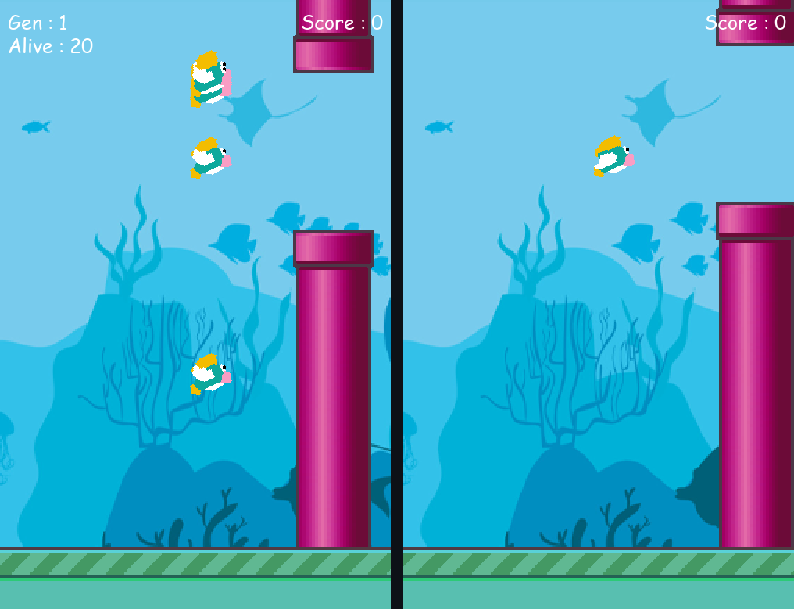

# Flappy Fish — NEAT AI

An underwater take on Flappy Bird, built with **Pygame**, plus an AI that **teaches itself to play** using **NEAT** (NeuroEvolution of Augmenting Topologies). No training data and no hand-written strategy: a population of neural networks evolves, generation after generation, until the fish swim through the pipes on their own.



## Two ways to run it

| Script | What it does |
|---|---|
| `train_ai.py` | Watch 50 AI-controlled fish evolve and learn to play |
| `play.py` | Play the game yourself |

## How the AI learns

Each generation, **50 fish** play at the same time, each controlled by its own small neural network.

**Inputs** (what a fish "sees"), for the next pipe:
1. The fish's height
2. Distance to the top pipe's opening
3. Distance to the bottom pipe

**Output**: one neuron with a `tanh` activation; if it is above `0.5`, the fish swims up.

**Fitness** (how a fish is scored):
- `+0.1` for every frame it stays alive
- `+5` for every pipe passed
- `-1` for crashing into a pipe

When every fish has crashed (or one reaches a score of 50), NEAT keeps the fittest networks, groups similar ones into species, and breeds the next generation through crossover and mutation. Mutations can change connection weights, but also **add or remove neurons and connections**, so the network structure itself evolves, starting from no hidden neurons. Training stops once a fish reaches the fitness threshold or after 50 generations.

All the evolution settings (population size, mutation rates, species threshold, activation, etc.) are in [`config-feedforward.txt`](config-feedforward.txt). In practice the fish often learn to swim through dozens of pipes within the first few generations.

## Getting started

Requires **Python 3.8+**.

```bash
pip install -r requirements.txt
python train_ai.py      # watch the AI learn
python play.py          # or play yourself
```

Training progress (fitness, species, best genome) is printed to the terminal for every generation.

### Controls

| Key | Action |
|---|---|
| `Space` / `↑` | Swim up (`play.py`) |
| `E` | Quit |

To add background music to `play.py`, put an `.mp3` file in a `music/` folder.

## Project structure

```
├── game.py                  # Shared game objects: Fish, Pipe, Base, drawing
├── play.py                  # Human-controlled game loop
├── train_ai.py              # NEAT training loop and fitness function
├── config-feedforward.txt   # NEAT hyperparameters
└── assets/                  # Fish, pipe, sand and ocean sprites
```

Collisions are pixel-perfect, using Pygame masks on the rotated fish sprite and the pipes.

## Acknowledgments

Built by adapting [Tech With Tim](https://www.youtube.com/@TechWithTim)'s *Flappy Bird AI with NEAT* tutorial, reworked into an underwater theme with fish sprites and an ocean background, a playable mode and a shared game module.

## License

[MIT](LICENSE)
